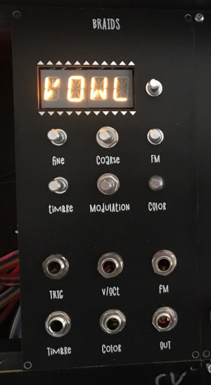
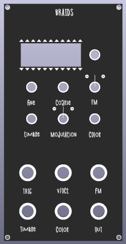

This is a KOSMO (Look Mum No Computer) version of the Mutable instruments
braids, based on the through-hole version done by
[sound-force.nl](http://sound-force.nl/?page_id=3179).
It has only 12 bits resolution in the output because the chip is easier to work
with and cheaper.

## Changes to original

This project is so far only different to the soundforce version in that I removed the
3.5mm jack sockets and replaced them with molex connectors to get them connected to the
larger 6.3mm jack sockets that KOSMO uses.
And I made the larger KOSMO panel.

This version is still with the old (soundforce-1.1) Version of the soundforce board, without the
termination series resistors on the SPI lines. I had no problems with this, but
I have not changed anything on the BRAIN board, so you can just use the original
gerbers.

## How to build:

Go download the latest gerber files
[here](https://github.com/sebastianbeyer/KOSMO_braids/releases/latest) and use
them to order PCBs. If you use jlcpcb to order, make sure you check "Specify a
location" at "Remove Order Number" for the panel.

For documentation and BOM look at
[sound-force.nl](http://sound-force.nl/?page_id=3179).

## How to program:

BratAttack made an awesome video on how to upload the firmware to the STM32!

## Changelog

### 1.1
Compared to the version in the top picture, I have made the cutout for the
display a little bit smaller and added small "+" and "-" indicators for
modulation and FM.

